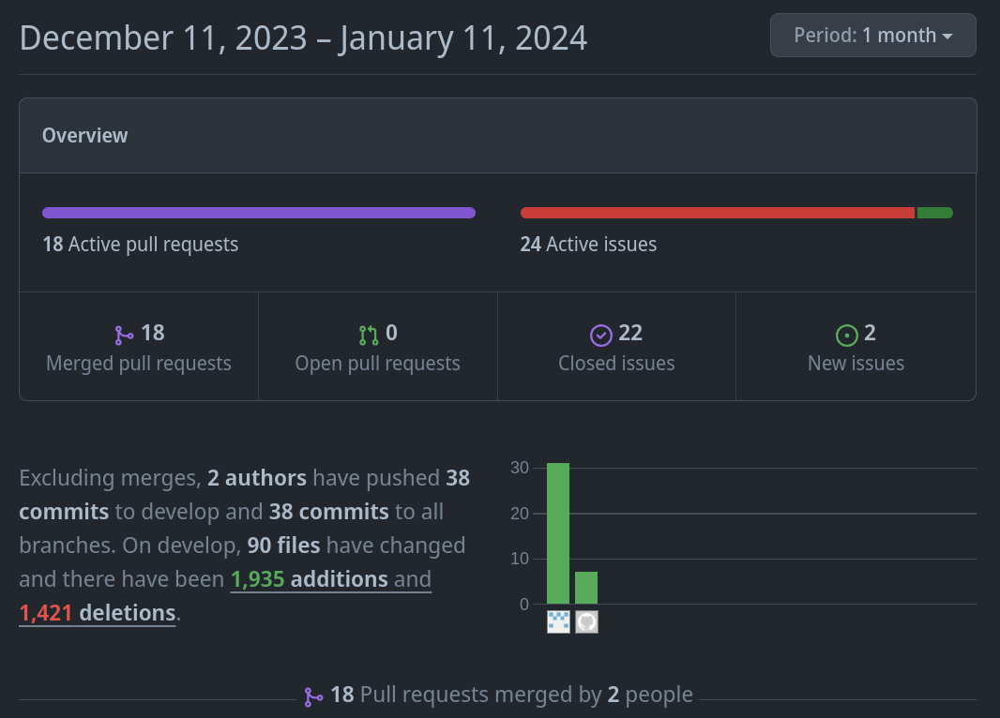
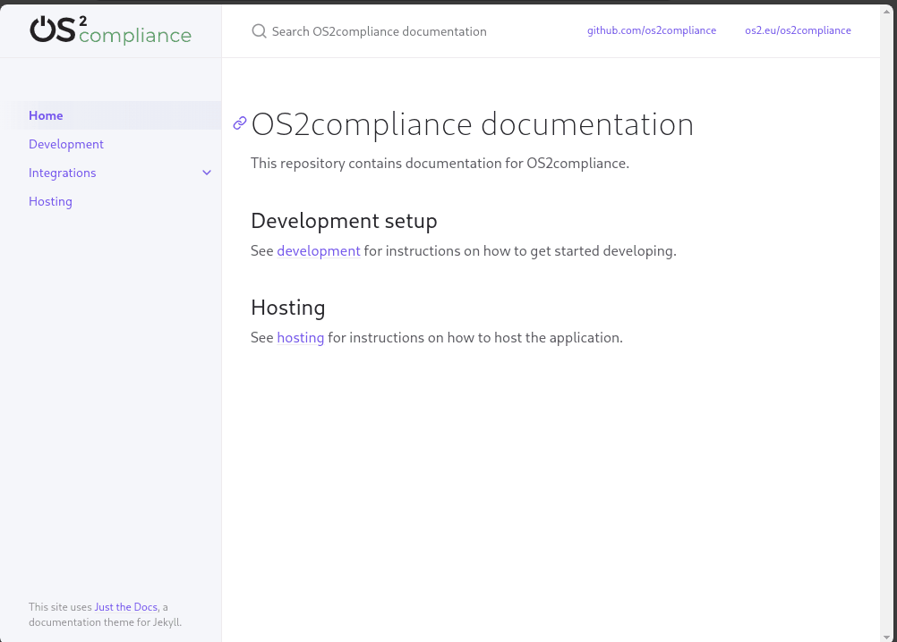

<!--
theme: uncover
transition: dissolve
class:
 - invert
headingDivider: 2 
paginate: false
-->

## 🔀 Alt i GitHub

[OS²compliance](https://github.com/OS2compliance/)
🔩
###### Standardisering | Transparens | Samarbejde

#

###### **🔩 Alle ændringer er tydelige og stemplet med tid, udvikler og formål**

#

###### **🔩 Dokumentationen følger fælles OS2 standard**

## 🧪 Intern modningsplatform

[OS²Lab](https://github.com/OS2lab)
🔩
###### Proof of Concept | 