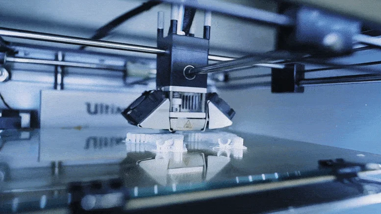

# ⚖️ [OS²compliance](https://github.com/OS2compliance/)

Transparens som grundlag for øget involvering, udbredelse og kvalitet.
<!-- transition: cube -->

#
<!-- header: "⚖️ [OS²compliance](https://github.com/OS2compliance/)" -->

TRANSPARENT SKABELONBASERET UDVIKLING
###### **🎟️ Alle ændringer er tydelige og stemples med dato, udvikler og formål**

#

SØGBAR STANDARDISERET DOKUMENTATION
###### **📖 Dokumentationen er standardiseret, versionsstyret og bygges automatisk**
<!-- Leverandørerne tager godt imod når vi stiller krav om standardisering og modernisering -->

# ♾️ [OS²Lab](https://github.com/OS2lab)
Standard OSS livscyklus som fundament for professionalisering
<!-- _header: "" -->

#

<!-- _header: "♾️ [OS2Lab](https://github.com/OS2lab)" -->

EFFEKTIV OG
PROFESSIONEL
DESIGNFASE

###### 🔬 **Kvalificerer dialogen om kerne behovene**
###### 🩻 **Leverandører kan trykprøves**

# 🪪 [OS²ID](https://github.com/OS2lab/OS2ID)
<!-- _header: "" -->
Fælles identitessikkerhed baseret på åbne standarder

# 
<!-- _header: "🪪 [OS²ID](https://github.com/OS2lab/OS2ID)" -->

SAMMENSAT AF EKSISTERENDE KOMPONENTER

###### 🔮 Bygget til fremtiden
###### ♻️ Klar til genbrug
<!--
###### 🎁 **Et NIS2 understøttende bidrag fra OS²** 
Bygger på standard teknologier (JWT OpenIDconnect) og

(Upstream first) - Baseret på upstream komponenten Authentik = delegeret vedligehold

Klar til genbrug (Open by default, Open Standards)
kan anvendes i andre os2produkter som authentication/authorization komponent istedet for at alle produkter laver sin egen integration til f.eks FK. og senere statens IT?

###### 🕋 Afgrænset kerne (Minimum viable Product) Kun basal login flow understøttes i PoC
 - Hvor langt kan man komme på 14 (arbejds)dage 100 timer - deraf 30 til at lave dokumentations arbejde på KOMBIT delen. KOMBIT er tung og svært at tilegne sig, så vi investerer i en mere simpel dokumentation til leverandørerne.

-->