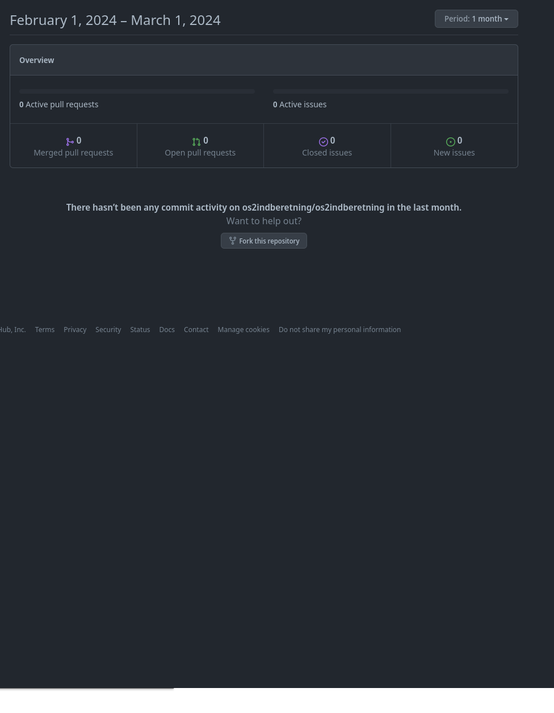

# Upstream first

# Professionalisering - 

Udvikling priotiteres til kernefunktionalitet der leverer direkte forretningsværdi, resten løses af åbne standard løsninger fra Open Source hylden.

Standardløsninger leverer færdigudviklet sikkerhed, compliance, skalering ud fra industry best-practice

Vejen ryddes for interoperabilitet og genbrug via allerede indbyggede åbne integrations standarder

Vedligeholdelsesbyrden distribueres til bred vifte af profesionelle udviklere i communitiet

# test

