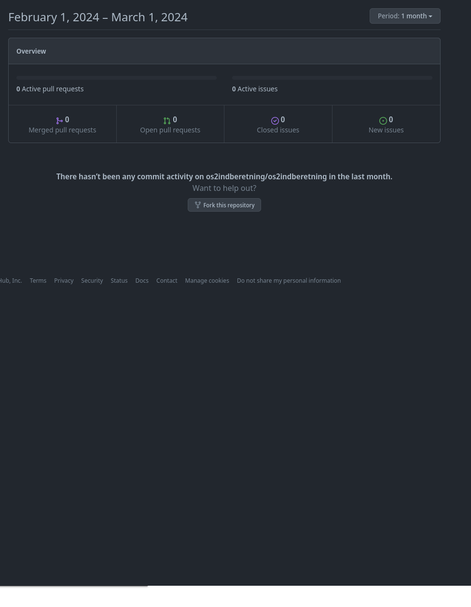
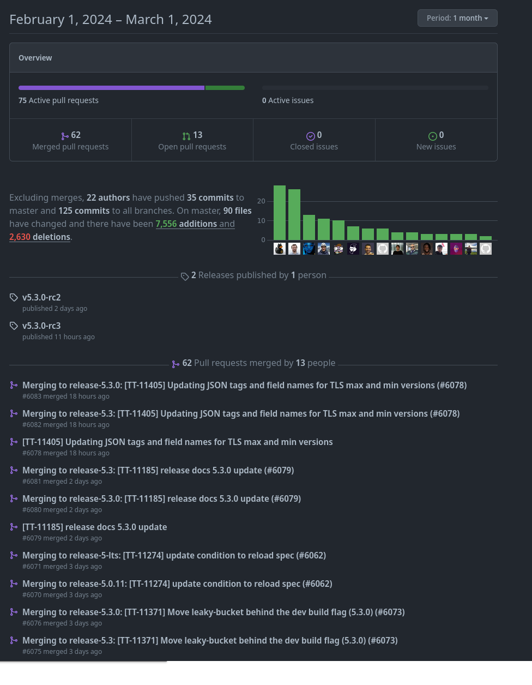

# **LOKALE MÅL**
###  🩹 Levetidsforlængelse?

### 💸 Besparelser?

### 🏅 Konkurrencedygtighed?

#  🧑🏼‍🤝‍🧑🏽 **FÆLLES MÅL**

##  📈 Udbredelse
## 🎯 Profesionalisering
## 💡 Talentudvikling

# 🎏 **NATIONALE MÅL**

# INTERNATIONALE MÅL

## Interoperabilitet

# Professionalisering
- Udvikling prioriteres til kernefunktionalitet der leverer direkte forretningsværdi, resten løses af åbne standard løsninger fra Open Source hylden.

- Standardløsninger leverer færdigudviklet sikkerhed, compliance, skalering ud fra industry best-practice

- Vejen ryddes for interoperabilitet og genbrug via allerede indbyggede åbne integrations standarder

- Vedligeholdelsesbyrden distribueres til bred vifte af profesionelle udviklere i communitiet

#

*"..one key reason why open source technology is a great choice. 
It gives an organization the flexibility to change rapidly."* 

# **SIKKERHED**
 *“Given enough eyeballs, all bugs are shallow,”*
###### **-Eric Steven Raymond “The Cathedral and the Bazaar.”**

<!-- The message here is that, given a large enough developer/tester base, almost every problem in a piece of software can be identified quickly and the fix will become obvious to someone. This is the benefit of having better software reviewing processes. The review audience of open source software systems is much larger and diverse. This not only makes the software better and more secure, but, in the case of a defect or vulnerability, it also enables finding a fix faster. -->

#
## <!-- fit --> - Aktivitet

#

quadrantChart
    title Activity and engagement on projects
    x-axis Low User Engagement --> High User Engagement
    y-axis Low Contributor Activity --> High Contributor Activity
    quadrant-1 Integrate with these
    quadrant-2 Research lack of engagement
    quadrant-3 Consider lifecycle analysis
    quadrant-4 Integrate upstream
    Kong Project: [0.9, 0.9]
    Tyk Project: [0.85, 0.86]
    OSindberetning: [0.51, 0.23]

## ········ ⏯️ .......................
