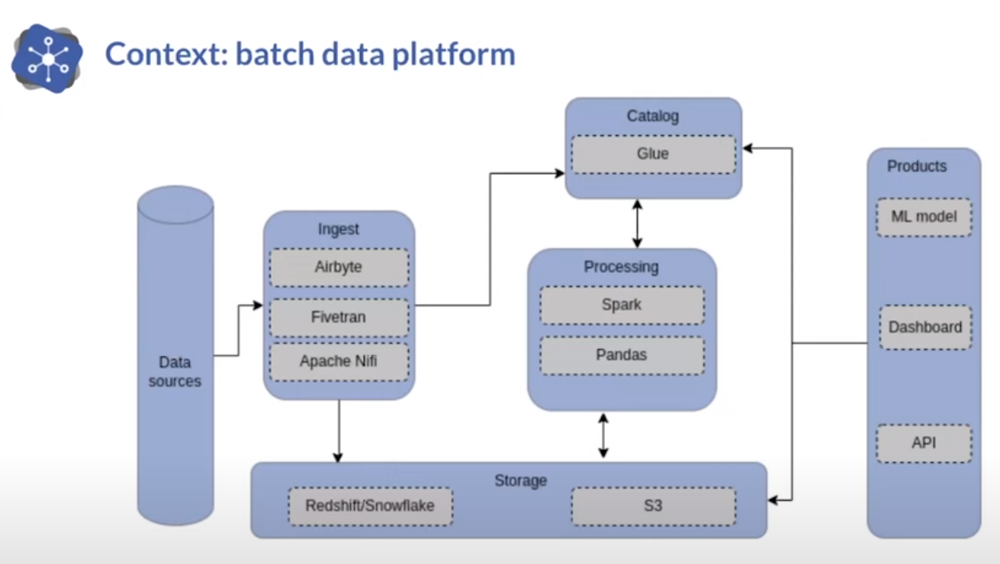

<!--
theme: uncover
transition: dissolve
class:
 - invert
headingDivider: 2 
paginate: false
-->
#

#### **JAN MAACK KJERBYE**

###### Enterprise Arkitekt - OS²

######  📨 jan@os2.dk

#
#### :infinity: Apache Superset
###### **Moderne explorativ dataanalyse**

# 
#### **BRED INDRAGELSE**

###### 👥 Flere indgangsvinkler til dataanalysen, både en explorativ UI-drevet indgang og en kodenær SQL tilgang.
###### 🔮 Fremtidssikret inddragelse af flest mulige medarbejderne på forskellige kompetence niveauer 
###### 🧬 Trædesten til at understøtte og udbrede data litteracy

# 
#### **STRATEGISK LEVERANCE**

###### ⚖️ Standardiseret, åbent og løskoblet
###### 🧩 Består af delbare og genbrugelige komponenter

# 
#### **FORRETNINGSVÆRDI**

###### 🛢 Ingen ventetid eller omkostninger til datamigrering
###### 📊 Fra data til dashboard på minutter, uden at miste fleksibilitet
###### :rocket: Bygget til fremtiden, forberedt til cloud og auto-skalering

#
#### **LÆS MERE**

###### 🔗 [Self-serve analytics for anyone](https://superset.apache.org/)
###### 📺 [Introduction to Data Modeling](https://www.youtube.com/watch?v=Bv_j6pHoPyI)
###### 📺 [Visualizing Geospatial Data with Apache Superset](https://www.youtube.com/watch?v=fwWJvbFTwGc)
###### 📖 [Data literacy som en sammensat kompetence](https://pure.au.dk/portal/da/publications/data-literacy-som-en-sammensat-kompetence(4056efd2-8e4a-45a8-b427-6cbfe14f5574).html)

# **DATA INTEGRATION**

NiFi - Solr - SQL?

Why NiFi - Cloudera supported - Python Processors

#
<!-- header: "**DATAPLATFORM**" -->

